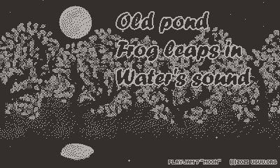

# Old pond, frog leaps in, water's sound

A short game for the Playdate console about taking a frog to the moon.

https://uguu-org.itch.io/old-pond

Created for [PlayJam 7](https://itch.io/jam/playjam-7) "Moon".

## Controls

When crank is undocked: use **Crank** to set direction.\
When crank is docked: use **Left** or **Right** to set direction.\
Press **A** or **B** or **Up** to jump.

## Options

**Reset**: regenerate path and reset completion times.\
**Frog**: adjust frog speed and trajectory display.\
**Crickets**: adjust cricket volume.

## Assets

Sound data are edited from these samples (Creative Commons 0):

   * Crickets by alienistcog: https://freesound.org/people/alienistcog/sounds/124425/
   * Frog croak by craigsmith: https://freesound.org/people/craigsmith/sounds/479816/
   * Splash by vibe_crc: https://freesound.org/people/vibe_crc/sounds/50623/

Frog images are traced from this model by Rukh3D (CC BY 4.0):

   * https://sketchfab.com/3d-models/frog-jump-a3e1dfd0a6134060a0e23d5772edb42f

I took picture of the moon, and drew everything else in Inkscape.
